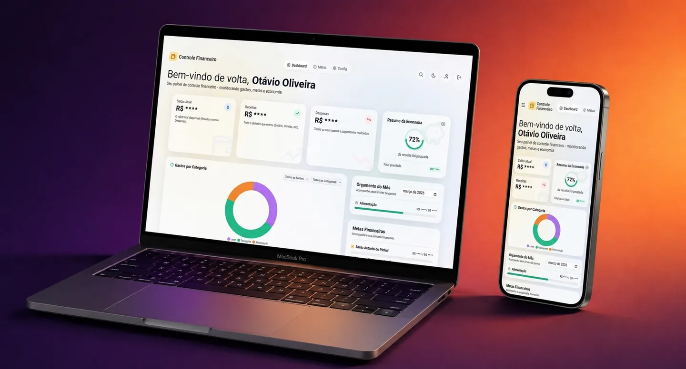

# Controle Financeiro

Aplicação web para gestão de finanças pessoais: cadastro de receitas e despesas, definição de metas e acompanhamento visual por meio de gráficos interativos, com persistência de dados no navegador.


[](https://otavio-2507.github.io/Controle_Financeiro/)

[](https://otavio-2507.github.io/Controle_Financeiro/)

## Visão geral

O Controle Financeiro centraliza a rotina de organização financeira pessoal em uma única tela: o usuário registra transações, categoriza cada movimentação e acompanha a evolução de receitas, despesas e metas em gráficos atualizados em tempo real. Todos os dados ficam armazenados localmente no navegador, sem necessidade de servidor ou cadastro.

## Funcionalidades

- Cadastro de transações de receita e despesa com descrição, valor, data e categoria
- Definição e acompanhamento de metas financeiras
- Gráficos interativos comparando receitas e despesas por período e categoria
- Resumo consolidado de saldo, entradas e saídas
- Persistência de dados via LocalStorage, mantendo o histórico entre sessões
- Interface responsiva, adaptada a desktop e dispositivos móveis

## Tecnologias

| Tecnologia | Aplicação no projeto |
| --- | --- |
| HTML5 | Estrutura semântica da aplicação |
| Tailwind CSS (CDN) | Estilização utilitária e layout responsivo |
| JavaScript (ES6+) | Lógica de transações, metas, cálculos e renderização |
| Chart.js | Gráficos interativos de receitas e despesas |
| Lucide Icons | Iconografia da interface |
| LocalStorage | Persistência local dos dados do usuário |

## Como executar

```bash
git clone https://github.com/OTAVIO-2507/Controle_Financeiro.git
cd Controle_Financeiro
```

Abra o arquivo `index.html` no navegador. Não há etapa de build: todas as dependências são carregadas via CDN.

## Estrutura do projeto

```
Controle_Financeiro/
├── index.html          Página única da aplicação
├── src/
│   ├── app.js          Lógica de transações, metas e gráficos
│   └── style.css       Estilos complementares ao Tailwind
└── docs/
    └── preview.webp    Imagem de prévia do README
```

## Autor

**Otávio Oliveira** — Desenvolvedor Full Stack

[GitHub](https://github.com/OTAVIO-2507) · [Portfólio](https://otavio-2507.github.io/Portifolio-v2/) · [E-mail](mailto:56otavio@gmail.com)
